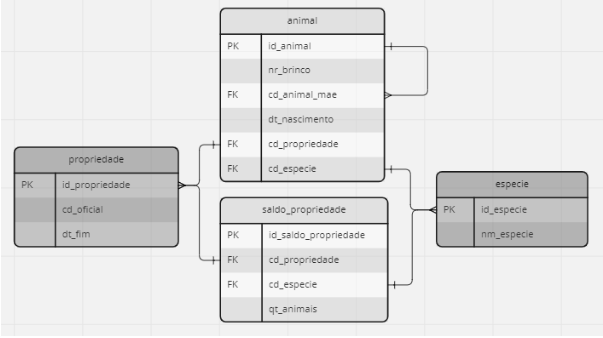

# SQL Challenge

# Descrição das tabelas:

Tabela **propriedade**: lista as propriedades onde são criados os animais.
- **id_propriedade**: identidade da tabela  
- **cd_oficial**: código oficial da propriedade  
- **dt_fim**: se preenchida, mostra a data em que a propriedade foi inativada  

Tabela **especie**: lista as espécies de animais cadastradas  
- **id_especie**: identidade da tabela  
- **nm_especie**: nome da espécie  

Tabela **animal**: lista cada animal da espécie bovino ou equino, com sua identificação individual.  
- **id_animal**: identidade da tabela  
- **nr_brinco**: número que identifica o animal no campo  
- **cd_animal_mae**: id_animal do registro que representa a mãe deste animal  
- **dt_nascimento**: data de nascimento do animal  
- **cd_propriedade**: id_propriedade da propriedade onde o animal se encontra  
- **cd_especie**: id_especie da espécie deste animal  

Tabela **saldo_propriedade**: lista os saldos de cada propriedade para animais sem identificação individual (ex: suínos e aves).  
- **id_saldo_propriedade**: identidade da tabela  
- **cd_propriedade**: id_propriedade da propriedade onde está contido este registro de saldo  
- **cd_especie**: id_especie dos animais deste registro de saldo  
- **qt_animais**: quantidade de animais referente a este registro de saldo   

# Desafio

Utilizando os dados contidos no banco, desenvolver as consultas SQL que devem retornar os dados de acordo com as seguintes especificações:

**Especificação 1**. Seleciona os animais da espécie equino pertencentes somente a propriedades ativas e retorna o id do animal e o código oficial da propriedade onde ele se encontra:

**Especificação 2**. Retorna o id de cada animal e o seu nr_brinco formatado de forma que sempre tenha 6 dígitos, preenchendo com zeros à esquerda (ex: nr_brinco 123 deve retornar '000123'):

**Especificação 3**. Retorna cada id e código oficial de propriedade e a quantidade total de animais que se encontram nela (somando das tabelas 'animal' e 'saldo_propriedade'):

**Especificação 4**. Seleciona todos os bovinos e equinos e retorna o id de cada animal, a sua espécie e a data de nascimento mais recente entre os seus filhotes (null caso não tenha), ordenado pelos animais com esta data mais recente e nulls por último:

